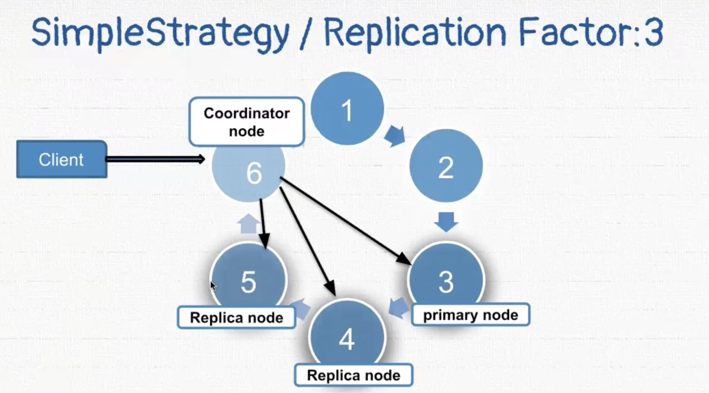
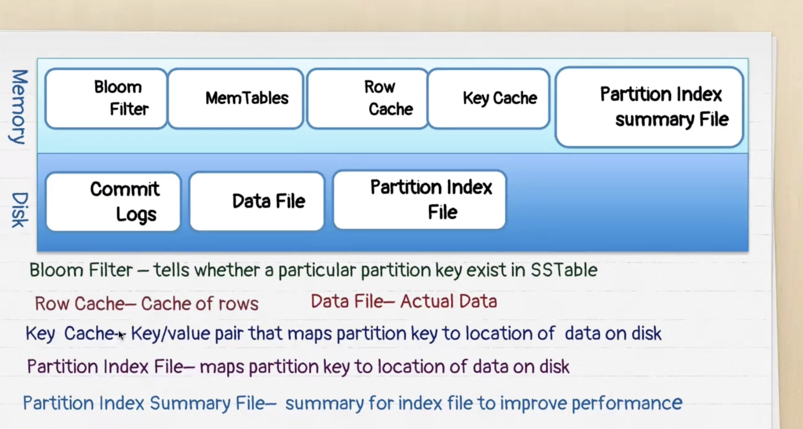
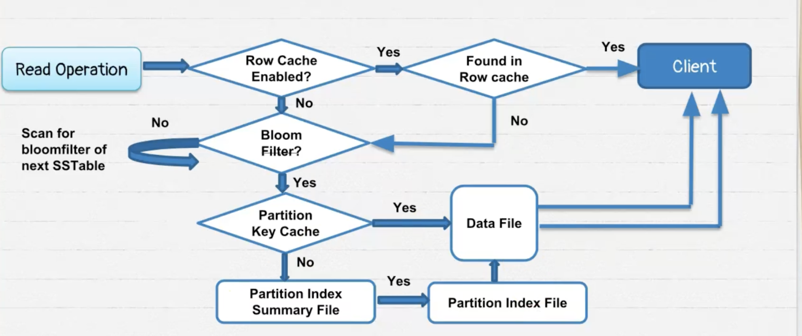
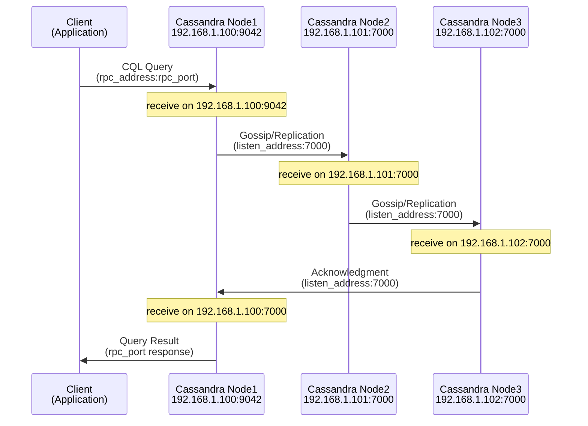

# APACHE CASSANDRA

```
Apache Cassandra is a distributed , decentralized , scalable and highly available no sql database. 

Distributed --> Capable of running on multiple nodes
Decentralized --> No master slave , Identical nodes , No single point of failure as there is no master , highly available
Scalability --> Add or remove nodes without any impact. No manual intervention and rebalancing data.
```

### when to use cassandra ?

a) High availability
b) changing data and schema
c) Consistency is not a conern (casandra is eventually consistent . consistency is tunable)
d) high write throughput --> faster writes 

### Astra DB - DataStax
Astra DB is a product of Datastax company and it provides Cassandra as a service.
Astra DB is Datastax’s managed Cassandra service that lets you deploy Cassandra clusters on any major cloud in minutes, with Datastax handling all admin and maintenance. You simply use what you need and pay only for what you consume.

### Cosmos -- Cassandra 

| Cosmos DB | Cassandra |
| --- | --- |
| Container | Table |
| Database | KeySpace |
| Cosmos DB Account | Cassandra Cluster |
| Cosmos SQL| CQL |

https://docs.datastax.com/en/astra-db-classic/cql/develop-with-cql.html


```
CREATE KEYSPACE qr_marketplace_space
with replication {
    class: 'NetworkTopologyStrategy',
    replication_factor:'3'
}
```

```
CQL cheatsheet


describe keyspaces; 
use pg_analytics_hub;

### Create Keyspace
create keyspace mq_events_space with replication  = {'class': 'SimpleStrategy', 'replication_factor': '1' };

describe mq_events_space;

use mq_events_space;

Create Table
create table contractors(
worker_id int,  
worker_name text,  
worker_age int,  
PRIMARY KEY((worker_id)));

describe tables;
describe contractors;

INSERT DATA
insert into contractors
(worker_id,worker_name,worker_age)
values(20,'alex',35);

insert into contractors
(worker_id,worker_name,worker_age)
values(10,'nina',28);

READ DATA
Select * from contractors;
Select * from contractors where worker_id=10 ;


Select * from contractors where worker_name='nina'; --> fails as worker_name is not the primary column. You can use where clause only on primary key and secondary indexes.

UPDATE DATA
Update contractors set worker_age=35 where worker_id=10;


Update contractors set worker_age=45 where worker_name='nina'; --> will throw an error as worker_name is not a primary key

DELETE DATA
Delete from contractors where worker_id=10;
Truncate contractors;

DROP KEYSPACE
Drop keyspace mq_events_space;

```


## 1. Do you need to mention all column names when inserting in Cassandra?

**Answer:** Mostly yes.

Cassandra requires you to specify all non-nullable columns when inserting, because it does not have the concept of auto-generated defaults like SQL databases.

**Example:**
```sql
INSERT INTO users (id, name, age) VALUES (1, 'Rajesh', 40);
```

If a column is defined without a default and you omit it, Cassandra will throw an error.

---

## 2. Can Cassandra do WHERE on non-primary-key columns?

**Answer:** No — not without ALLOW FILTERING.

Cassandra can only do efficient WHERE queries on:
- partition key
- clustering columns

Anything else requires:
```sql
SELECT * FROM users WHERE age = 40 ALLOW FILTERING;
```

**Why is this dangerous?**
- It scans multiple partitions
- It can cause huge performance issues
- It is not recommended for production

**Why?**
Because Cassandra is designed for query-based modeling. You design tables per query pattern, not like relational databases.

---

## Quick comparison with Cosmos DB

| Feature | Cassandra | Cosmos DB |
| --- | --- | --- |
| Insert behavior | Must specify all required columns | Can omit non-required fields |
| Query flexibility | Very strict; PK-only | Much more flexible |
| Secondary indexes | Limited | Strong support |
| Data modeling | Query-first | Schema-flexible |

---

## Different NoSQL philosophies

| NoSQL Type | Example | Schema behavior |
| --- | --- | --- |
| Document store | Cosmos DB, MongoDB | Schema-flexible; each item can differ |
| Wide-column store | Cassandra | Schema-fixed; columns defined upfront |
| Key-value store | Redis | No schema |
| Graph store | Neo4j, Cosmos Gremlin | Schema-flexible graph model |

---


Cassandra is NoSQL, but NOT schema‑less.
Cosmos DB is schema‑flexible; Cassandra is NOT.  
You cannot insert arbitrary, varying‑shape documents in Cassandra the way you can in Cosmos DB.


## Cassandra Keys and Data Distribution

In Cassandra, the primary key consists of two parts: the **partition key** and the **clustering key**. The partition key determines how data is distributed across the cluster—each node is assigned a token range via a partitioner hashing function, and rows with the same partition key always go to the same node. The clustering key determines how data is physically sorted and stored within a single node; rows with the same partition key are stored together and sorted by their clustering key values.


## Primary key = Partition key + Clustering key


---

## Hands-On Example: Books by Author Table

A practical example demonstrates how partition and clustering keys work together. In a `books_by_author` table:
- **Partition key:** `author_name` (all books by the same author go to the same node)
- **Clustering keys:** `published_year` (descending), `rating` (ascending)

This ensures books are sorted with the latest year first, and within each year, by rating from lowest to highest.

**Critical Query Rules:**
- The **partition key is mandatory** in any WHERE clause. Without it, Cassandra must scan all nodes (extremely slow and inefficient)
- **Clustering keys are optional** and can be used partially in WHERE clauses
- Queries omitting the partition key require `ALLOW FILTERING`, which scans multiple partitions and severely degrades performance—**not recommended for production**
- **Better alternatives to ALLOW FILTERING:**
  1. Create secondary indexes on non-key columns (use sparingly, as too many indexes hurt write performance)

```

Create Table with Partition/Clustering keys
CREATE TABLE products_inventory(
creator_id TEXT,
release_month INT,  
item_code UUID,
item_name TEXT,
score FLOAT,
PRIMARY KEY((creator_id),release_month,score))
WITH CLUSTERING ORDER BY (release_month DESC,score ASC);


// In the above table PRIMARY KEY((creator_id),release_month,score)) creator_id is partitionKey . release_month and score are clusterKeys.

Insert Data
INSERT INTO products_inventory
(creator_id, release_month, item_code, item_name, score)
VALUES('Xavier Knight',2008,uuid(),'Mystery Tales',4);

INSERT INTO products_inventory
(creator_id, release_month, item_code, item_name, score)
VALUES('Xavier Knight',2021,uuid(),'Azure Chronicles',4);

INSERT INTO products_inventory
(creator_id, release_month, item_code, item_name, score)
VALUES('Xavier Knight',2008,uuid(),'Distant Journey',4.5);

INSERT INTO products_inventory
(creator_id, release_month, item_code, item_name, score)
VALUES('Xavier Knight',2008,uuid(),'Colors of Dawn',3.5);

INSERT INTO products_inventory
(creator_id, release_month, item_code, item_name, score)
VALUES('Xavier Knight',2018,uuid(),'Leader Lost',4.5);

Reading Data

SELECT * FROM products_inventory
WHERE creator_id='Xavier Knight'
AND release_month > 2008;

SELECT * FROM products_inventory
WHERE release_month > 2008; --> throws error

SELECT * FROM products_inventory
WHERE release_month > 2008 ALLOW FILTERING;

SELECT * FROM products_inventory
WHERE creator_id='Xavier Knight'
AND release_month > 2008 AND release_month <2021;

SELECT * FROM products_inventory
WHERE creator_id='Xavier Knight'
AND item_name='Distant Journey';

```


## UUID DataType
```
CREATE TABLE products_inventory(
creator_id TEXT,
release_month INT,  
item_code UUID,
item_name TEXT,
score FLOAT,
PRIMARY KEY((creator_id),release_month,score))
WITH CLUSTERING ORDER BY (release_month DESC,score ASC);

INSERT INTO products_inventory
(creator_id, release_month, item_code, item_name, score)
VALUES('Carmen Sofia',2017,uuid(),'Oracle',4);

Time UUID DataType
ALTER TABLE products_inventory
ADD item_timeuuid TIMEUUID;

INSERT INTO products_inventory
(creator_id, release_month, item_code, item_timeuuid, item_name, score)
VALUES('Diego',2017,uuid(),now(), 'Foundation',4);

Select * from products_inventory where creator_id='Diego';
```


## Set DataType
```
ALTER TABLE products_inventory
ADD emails SET<TEXT>;

DESCRIBE products_inventory;

UPDATE products_inventory
    SET emails = {'robert@domain.com', 'robert@network.com'}
    WHERE creator_id='Carmen Sofia'
AND release_month=2017
AND score=4;

UPDATE products_inventory
    SET emails = emails + {'robert5678@network.com', 'robert@domain.com'}
    WHERE creator_id='Carmen Sofia'
AND release_month=2017
AND score=4;

UPDATE products_inventory
    SET emails = emails - {'robert5678@network.com'}
    WHERE creator_id='Carmen Sofia'
AND release_month=2017
AND score=4;


UPDATE products_inventory
    SET emails = { }
    WHERE creator_id='Carmen Sofia'
AND release_month=2017
AND score=4;
```

### List DataType
```
ALTER TABLE products_inventory
ADD phone LIST<TEXT>;

UPDATE products_inventory
    SET phone = ['1-180-11100']
    WHERE creator_id='Carmen Sofia'
AND release_month=2017
AND score=4;

UPDATE products_inventory
    SET phone = phone + ['1-180-11101']
    WHERE creator_id='Carmen Sofia'
AND release_month=2017
AND score=4;

UPDATE products_inventory
    SET phone[1] = '1-180-11102'
    WHERE creator_id='Carmen Sofia'
AND release_month=2017
AND score=4;


UPDATE products_inventory
    SET phone = phone - ['1-180-11101']
    WHERE creator_id='Carmen Sofia'
AND release_month=2017
AND score=4;

UPDATE products_inventory
    SET phone = []
    WHERE creator_id='Carmen Sofia'
AND release_month=2017
AND score=4;
```

### Map DataType
```
ALTER TABLE products_inventory
ADD family MAP<TEXT,TEXT>;

UPDATE products_inventory
    SET family = {'Wife': 'Isabella', 'Sibling': 'Marcus'}
    WHERE creator_id='Carmen Sofia'
AND release_month=2017
AND score=4;

UPDATE products_inventory
    SET family = family + {'Son': 'Leonardo'}
    WHERE creator_id='Carmen Sofia'
AND release_month=2017
AND score=4;

UPDATE products_inventory
    SET family = family - {'Wife'}
    WHERE creator_id='Carmen Sofia'
AND release_month=2017
AND score=4;

```


### Cassandra Complex Data Types Summary:

UUID vs TimeUUID – Both are 128-bit hexadecimal identifiers; UUID is randomly generated, while TimeUUID is generated based on system MAC address, time, and sequence number. 

Set – Collection that prevents duplicates and doesn't maintain insertion order. 

List – Maintains insertion order and allows duplicates, but index-based updates and element deletion are not supported on Astra DB due to performance concerns (requires read-before-write). 

Map – Collection of key-value pairs with add/remove/update operations.


## Summary: Cassandra Replication

**Why Replication Matters:**
In distributed systems, hardware failures are inevitable. Replication is essential for high availability instead of keeping just one copy of data.

**Two Key Components:**
1. **Replication Factor** – Determines how many copies of data exist (e.g., RF=3 means 3 identical copies)
2. **Replication Strategy** – Determines which nodes will store those copies

**Simple Strategy:**
- Replicas are placed on *consecutive nodes*
- Example: Primary node is 3 → replicas go to nodes 4 and 5 (with RF=3)
- Coordinator node finds the primary (via partition key token) and sends write requests to consecutive replica nodes

**Network Topology Strategy:**
- Used for multi-datacenter deployments
- Allows different replication factors per datacenter
- Example: USA datacenter RF=3, Europe datacenter RF=2
- Process:
  1. Local coordinator finds primary and replica nodes in its datacenter
  2. Sends write request to them
  3. Contacts a remote coordinator in the other datacenter
  4. Remote coordinator repeats the process in its datacenter based on its own replication factor

Both strategies ensure data redundancy and availability across the cluster.




---

## Write Consistency

### Tunable Consistency

Cassandra supports **tunable consistency**, which allows you to dynamically adjust the balance between consistency and performance:

- **Increase or decrease consistency** – Flexibility to choose consistency level per operation
- **Trade-off between consistency & performance** – Higher consistency requires more replica confirmations, reducing performance
- **Configure separately for reads and writes** – Read and write consistency levels are independent

### Write Consistency Levels

**Write Consistency** defines how many replica nodes must acknowledge a write operation before the coordinator confirms success to the client.

| Consistency Level | Behavior | Use Case |
| --- | --- | --- |
| **One** | Coordinator waits for acknowledgment from only 1 replica node | High performance, lowest durability; acceptable for non-critical data |
| **Quorum** | Coordinator waits for acknowledgment from exactly N/2 + 1 replica nodes (where N = replication factor) | Balanced approach; recommended for most applications; guarantees majority consistency |
| **All** | Coordinator waits for acknowledgment from **all** replica nodes | Strongest consistency, highest latency; acceptable for critical data where consistency is paramount |
| **Local_Quorum** | Coordinator waits for quorum within the **local datacenter only** | Multi-datacenter deployments; reduces inter-datacenter latency while maintaining local consistency |
| **Each_Quorum** | Coordinator waits for quorum acknowledgment from **each datacenter** | Multi-datacenter deployments; ensures consistency across all datacenters; slower than Local_Quorum but stronger guarantee |

### How Write Consistency Works

The coordinator node receives the write request and:
1. Determines the primary and replica nodes (based on replication strategy)
2. Sends write request to all replica nodes
3. Waits for acknowledgments based on the consistency level
4. Returns success to the client once the required number of replicas acknowledge

**Example with RF=3 and Quorum consistency:**
- 3 total replicas exist
- Quorum = 3/2 + 1 = 2
- Coordinator waits for 2 nodes to acknowledge, then returns success to client
- This ensures data durability while allowing 1 node to fail without blocking writes

### Each_Quorum in Multi-Datacenter Environments

**Each_Quorum** is specifically designed for **multi-datacenter deployments** and provides strong consistency guarantees across all datacenters.

**How Each_Quorum works:**
- The coordinator waits for a **quorum of nodes to acknowledge from each datacenter**
- If you have 2 datacenters with RF=3 each:
  - Datacenter 1: Needs quorum acknowledgment (2 out of 3 nodes)
  - Datacenter 2: Needs quorum acknowledgment (2 out of 3 nodes)
  - Total: Coordinator waits for acknowledgment from 4 nodes (quorum from each DC)

**Example comparison:**
| Scenario | Local_Quorum | Each_Quorum |
| --- | --- | --- |
| 2 datacenters, RF=3 each | Waits for quorum from local DC only (2 nodes) | Waits for quorum from each DC (2+2=4 nodes) |
| Latency | Lower (local only) | Higher (must wait for remote datacenters) |
| Consistency | Strong within local DC, eventual across DCs | Strong across all datacenters |
| Use case | Acceptable for read-after-write in local DC | Critical data requiring global consistency |

### Consistency Level Selection

- **Performance priority** → Use `One` (fastest, but least safe)
- **Balanced needs** → Use `Quorum` (recommended default)
- **Strongest guarantee** → Use `All` (slowest, but most consistent)
- **Multi-datacenter (local consistency)** → Use `Local_Quorum` to avoid WAN latency
- **Multi-datacenter (global consistency)** → Use `Each_Quorum` to ensure quorum in every datacenter (slower but stronger cross-datacenter guarantee)

---

## Read Consistency

Read consistency levels share the same names as write consistency (`One`, `All`, `Quorum`, `Local_Quorum`) but operate differently. The key difference is that read operations can perform **background repair** to resolve inconsistencies without blocking the client.

### Read Consistency Level One

**Process:**
1. Coordinator consults the **Snitch program** (determines network topology and fastest nodes)
2. Coordinator sends read request to the **fastest node only**
3. Returns data to client immediately
4. In the background, checks other replica nodes for consistency
5. If inconsistency detected, initiates **read repair** to sync data

**Advantage:** Fastest reads (lowest latency)  
**Trade-off:** Eventual consistency; may return stale data temporarily

### Read Consistency Level Quorum

**Process (with Quorum = 2):**
1. Coordinator consults Snitch program for fastest and second-fastest nodes
2. Sends **read request** to fastest node (gets actual data)
3. Sends **digest request** to second-fastest node (gets hash/checksum of data)
4. Compares the two:
   - **If match:** Data is consistent, returns data to client
   - **If mismatch:** 
     - Sends read request to second-fastest node to get actual data
     - Merges both datasets based on **latest timestamp** per column
     - Returns merged data to client
5. In background, initiates **read repair** to sync inconsistent nodes

**Why hash instead of full data?** Saves network bandwidth—transferring full data is expensive  
**Advantage:** Balanced consistency and performance  
**Trade-off:** Requires two node responses before returning to client

### Read Consistency Level Local_Quorum

**Process (multi-datacenter setup):**
1. Coordinator sends read request to **two replica nodes in the same datacenter** only
2. Does not communicate with remote datacenters initially
3. Compares data consistency locally (same process as Quorum)
4. In background, checks consistency across remote datacenters as well
5. If remote replicas are inconsistent, initiates **read repair** across datacenters

**Advantage:** Lower latency for multi-datacenter deployments (no WAN delay for primary response)  
**Trade-off:** Remote datacenters eventually consistent via background repair

### Read Consistency Level All

**Process:**
1. Coordinator sends read request to **all replica nodes**
2. Waits for all responses before returning to client
3. Performs consistency check across all nodes

**Advantage:** Strongest consistency guarantee  
**Trade-off:** Slowest reads; if any node is down, read fails

### Each_Quorum for Reads

**Not supported** for read operations because it would require the coordinator to wait for quorum responses from each datacenter, which is too expensive and causes excessive latency. Multi-datacenter read consistency is better achieved with `Local_Quorum` + background repair.

### Read Repair

**Read repair** is an automatic background process triggered when consistency issues are detected during reads. It ensures that:
- Stale replicas are updated with latest data
- Consistency is eventually achieved across all nodes
- Doesn't block the client response

### Read Consistency Summary

| Level | Nodes Contacted | Response Speed | Consistency | Use Case |
| --- | --- | --- | --- | --- |
| **One** | Fastest node only | Fastest | Eventual (via background repair) | High-performance reads; eventual consistency acceptable |
| **Quorum** | 2 nodes (1 for data, 1 for digest) | Medium | Strong (via comparison and merge) | Default for balanced reads |
| **All** | All replicas | Slowest | Strongest | Critical reads requiring absolute consistency |
| **Local_Quorum** | Quorum in local DC only | Medium (local) | Strong locally, eventual globally | Multi-datacenter reads prioritizing latency |

---

## Gossip Protocol

The **Gossip Protocol** is Cassandra's mechanism for nodes to share state information with each other. It's a peer-to-peer communication protocol that ensures all nodes in the cluster stay synchronized without centralized coordination.

### How Gossip Works

**Basic Process:**
1. Each node continuously initiates gossip sessions with other random nodes
2. When nodes connect, they exchange state information about themselves and other nodes they know about
3. Information propagates exponentially throughout the cluster
4. Within minutes, the entire cluster is updated with the latest state information

**Example with 6-node cluster:**
- Node A gossips with Node D → D learns A's state and shares D's state back
- Node E then gossips with Node D → E receives D's state + information about A
- Information flows rapidly and efficiently through these peer-to-peer exchanges
- This process repeats continuously, every second

### Failure Detection: Accrual Failure Detection Model

Instead of marking nodes as simply "dead" or "alive" (binary assessment), Cassandra uses the **Accrual Failure Detection Model**:

**Suspicion Level:**
- Assigns a **probability value** to each node indicating likelihood of failure
- Not a binary dead/alive determination
- More nuanced approach that accounts for network delays and intermittent issues
- A node that doesn't respond is assigned increasing suspicion levels rather than immediately marked dead

**Advantages:**
- Handles temporary network partitions gracefully
- Reduces false positives when detecting node failures
- Allows cluster to make intelligent decisions about unresponsive nodes

### Gossip Class and Initialization

**Gossip Class Role:**
1. Initiates gossip sessions with **random nodes** in the cluster
2. Collects state information from the selected node
3. Maintains a **local list of state information** about all known nodes
4. Updates this list with new information received from gossip sessions

**Key Point:** By gossiping with random nodes, Cassandra ensures:
- Information spreads uniformly across the cluster
- No single point of failure in information dissemination
- Resilient communication that works even with partial network failures

### Gossip Protocol Characteristics

| Aspect | Behavior |
| --- | --- |
| **Frequency** | Continuous (every second) |
| **Honesty** | Nodes never lie; only share truthful state information |
| **Scalability** | Information propagates exponentially, reaching all nodes quickly |
| **Failure Detection** | Uses suspicion levels instead of binary dead/alive |
| **Randomness** | Gossip targets chosen randomly to ensure uniform information spread |
| **Local State** | Each node maintains a local list of known node states |

### Why Gossip Protocol Matters

- **Cluster awareness:** All nodes automatically know the health and state of other nodes
- **Automatic recovery:** Dead nodes are detected and the cluster adapts
- **Decentralized:** No single coordinator needed for state management
- **Resilience:** Works even if some communication paths fail
- **Fast convergence:** Information spreads exponentially, cluster synchronizes within minutes

---

## Write Operation on a Single Node

When a write operation reaches a single node in the Cassandra cluster, it goes through a specific sequence of steps to ensure durability and maintain immutable data structures.

### Write Path: Step-by-Step Process

**1. Commit Log (Crash Recovery)**
- Write is **immediately written to the Commit Log** on disk
- The Commit Log is a sequential disk file used for **crash recovery**
- If the system crashes, the Commit Log ensures no data loss
- **One Commit Log per node/machine**
- Acts as a write-ahead log (WAL) ensuring durability before in-memory operations

**2. MemTable (In-Memory)**
- After commit log, data is written to the **MemTable**
- MemTable is an in-memory data structure (typically implemented as a sorted tree)
- **Each table has its own MemTable**
- Provides fast in-memory access to recently written data
- Memory is limited, so MemTables cannot hold all data indefinitely

**3. Threshold and Flushing**
- When a MemTable reaches a configured **threshold size** (memory limit), it is **flushed to disk**
- MemTable contents are written to an **SSTable** (Sorted String Table)
- A **new MemTable is created** for that table to accept future writes
- This process is called **memtable flush**

**4. SSTables (Immutable Disk Files)**
- SSTables are immutable disk files storing sorted key-value data
- Once data is written to an SSTable, **it cannot be changed**
- Multiple SSTables accumulate on disk over time
- Data is organized in sorted order for efficient range queries and compaction

### Write Flow Diagram

```
Write Request
    ↓
[1] Commit Log (Disk) ← Immediate write for crash recovery
    ↓
[2] MemTable (In-Memory) ← Data becomes queryable immediately
    ↓
[Memory Threshold Reached?]
    ↓
[3] Flush to SSTable (Disk) ← Immutable file created
    ↓
[4] New MemTable Created ← Ready for more writes
```

### Updates and Deletes: Immutable Architecture

**Key Insight:** In Cassandra, **every operation (INSERT, UPDATE, DELETE) is fundamentally a WRITE operation**, not a true modification or deletion.

**Why?**
- SSTables are immutable—data cannot be modified in place
- Instead of changing existing data, Cassandra writes a new record with:
  - A **newer timestamp** (for updates/overwrites)
  - A **tombstone marker** (for deletes)
  - A **newer version** that supersedes previous values

**How Updates Work:**
- An UPDATE writes a new version of the row with a newer timestamp
- During read, Cassandra sees multiple versions and returns the one with the latest timestamp
- Old versions are eventually cleaned up during **compaction**

**How Deletes Work:**
- A DELETE writes a **tombstone marker** instead of removing data
- The tombstone has a timestamp indicating when the deletion occurred
- During reads, tombstones are filtered out
- During **compaction**, tombstones and old versions are permanently removed (after grace period)

**Advantage of this approach:**
- Write performance is optimized (all writes go directly to MemTable/SSTable)
- No need for in-place updates (which would require random disk I/O)
- Maintains immutable data structure guarantees
- Enables efficient replication and consistency

### MemTable and SSTable Architecture Summary

| Component | Type | Location | Purpose | Immutable? |
| --- | --- | --- | --- | --- |
| **Commit Log** | Sequential file | Disk | Crash recovery & durability | Yes |
| **MemTable** | In-memory structure | Memory | Fast access to recent writes | No (discarded after flush) |
| **SSTable** | Sorted file | Disk | Persistent sorted data storage | Yes |

### Compaction

SSTables accumulate over time as writes continue. The **compaction process** (covered separately) merges multiple SSTables and removes:
- Expired data (TTL expired)
- Deleted data (tombstones past grace period)
- Duplicate versions (keeping only the latest)

This maintains efficient storage and read performance as the database grows.

---

## Cassandra Storage Architecture

Cassandra uses multiple in-memory and on-disk components to optimize both read and write performance.

### In-Memory Data Structures

| Component | Purpose | Notes |
| --- | --- | --- |
| **Bloom Filter** | Quickly determines if a partition key exists in an SSTable | Associated with each SSTable; may produce false positives (says key exists when it doesn't) |
| **Row Cache** | Caches subset of rows in memory | Configurable: `all` (cache all rows), `none` (no cache), or `N` (N rows per partition key); avoid caching all rows in production |
| **Key Cache** | Maps partition keys to their disk locations | Improves reads but can slow writes; enable/disable based on read vs write intensity |
| **Partition Index Summary** | In-memory summary of partition index file | Contains key ranges and locations; improves index lookup performance |

### SSTable Components

An SSTable is not a single file but a collection of components:

| Component | Type | Purpose |
| --- | --- | --- |
| **Bloom Filter** | In-memory | Quick existence check for partition keys |
| **Data File** | Disk | Actual data: partition keys and associated rows in sorted order |
| **Partition Index File** | Disk | Maps partition keys to their locations in data file |
| **Partition Index Summary** | In-memory | Quick lookup guide for partition index file (range-based) |

### How They Work Together

1. **Bloom Filter** → Fast check: "Does partition key exist in this SSTable?"
2. **Key Cache** → Lookup: "What's the disk location for this partition key?"
3. **Partition Index Summary** → Navigate index file faster (skip unnecessary sections)
4. **Partition Index File** → Get exact disk location of partition key
5. **Data File** → Retrieve actual data from disk

### Storage Optimization

- **Bloom Filter:** Avoids unnecessary disk reads with false-positive guarantees
- **Row Cache:** Improves read performance for hot data (use cautiously)
- **Key Cache:** Beneficial for read-heavy workloads; disable for write-heavy workloads
- **Index Summary:** Reduces memory footprint while maintaining fast lookups






---

## MemTable vs Bloom Filter, Row Cache, and Key Cache

### Key Differences

MemTable is **fundamentally different** from Bloom Filter, Row Cache, and Key Cache:

| Aspect | MemTable | Bloom Filter / Row Cache / Key Cache |
| --- | --- | --- |
| **Purpose** | Stores unflushed writes (hot data) | Optimization structures for reading from SSTables |
| **Data** | Recent writes not yet persisted to SSTable | Already-persisted SSTable data metadata/cache |
| **Lifecycle** | Temporary (discarded after flush to SSTable) | Persistent (tied to SSTable lifespan) |
| **Source** | Current write operations | Historical/flushed data from disk |
| **Update Frequency** | Continuous (with every write) | Static (no updates; recreated on compaction) |

**Key Point:** MemTable contains the **most recent data**, while the other structures help optimize reads from older, already-flushed SSTables.

### Read Operation Sequence

When a read request arrives at a Cassandra node, it follows this exact sequence:

```
Read Request
    ↓
[1] CHECK MEMTABLE (Memory)
    ↓ (Found? Return immediately)
    ↓ (Not found? Continue)
[2] CHECK ROW CACHE (Memory)
    ↓ (Found and cached? Return immediately)
    ↓ (Not found or cache disabled? Continue)
[3] CHECK BLOOM FILTER for each SSTable (Memory)
    ↓ (Key doesn't exist? Skip this SSTable)
    ↓ (Key might exist? Continue)
[4] CHECK KEY CACHE (Memory)
    ↓ (Found location? Jump to step 6)
    ↓ (Not in cache? Continue)
[5] CHECK PARTITION INDEX SUMMARY → PARTITION INDEX FILE (Disk)
    ↓ (Get exact disk location)
[6] READ DATA FILE (Disk)
    ↓
Return Data (possibly merged with other replica data)
```

### Detailed Explanation

**1. MemTable (Checked First)**
- **Why first?** Contains the most recent writes that haven't been flushed to disk yet
- **Search:** Linear scan through in-memory sorted structure (tree-based)
- **Result:** If found, return immediately (hot data)
- **Impact:** Single-node operation, fastest response

**2. Row Cache (Checked Second)**
- **Why?** If row cache is enabled and this row is cached, avoid disk reads
- **Search:** Hash lookup of partition key + clustering key
- **Configurable:** Can be `all`, `none`, or `N` rows per partition
- **Result:** If found and cached, return immediately
- **Impact:** Improves read latency for hot rows

**3. Bloom Filter (Per SSTable)**
- **Why?** Avoid unnecessary disk I/O for non-existent keys
- **Search:** Probabilistic check (may have false positives)
- **Result:** If definitely NOT present, skip this SSTable; if MAYBE present, continue
- **Impact:** Eliminates unnecessary SSTable scans

**4. Key Cache (Optional Optimization)**
- **Why?** Cache partition key → disk location mappings to avoid index lookups
- **Search:** Hash lookup of partition key
- **Result:** If found, jump directly to data file location
- **Impact:** Skips partition index file read if cache hit

**5. Partition Index File (If Key Cache Miss)**
- **Why?** Locate where partition data is stored in the data file
- **Search:** Binary search through sorted partition keys
- **Result:** Exact disk offset/location for the partition
- **Impact:** Enables efficient SSTable data file access

**6. Data File Read**
- **Why?** Retrieve actual data from disk
- **Search:** Jump to location from partition index and read rows
- **Result:** Get actual data and return to client
- **Impact:** Final disk I/O step

### MemTable vs Row Cache: Key Distinction

| MemTable | Row Cache |
| --- | --- |
| Automatically created for every write | Only created if explicitly enabled |
| Contains ALL recent unflushed writes | Only caches configurable subset of rows |
| Checked FIRST in every read | Checked SECOND (if enabled) |
| Temporary (flushed to SSTable) | Persistent (tied to SSTable) |
| Always contains latest data | May contain stale data (but refreshed on write) |

### Optimization Strategy

- **For Write-Heavy Workloads:** Disable Row Cache and Key Cache (improves write performance)
- **For Read-Heavy Workloads:** Enable Row Cache and Key Cache (improves read performance)
- **For Balanced Workloads:** Enable Key Cache but limit Row Cache to avoid memory pressure
- **MemTable:** Always active; cannot be disabled (essential for consistency)

---

## Compaction Process

### Why Compaction is Needed

As MemTables continuously flush to disk, **thousands of SSTables accumulate** on the disk. Scanning multiple SSTables during read operations becomes expensive and slow. **Compaction merges multiple SSTables into fewer, consolidated SSTables**, reducing read overhead.

### What Compaction Does

1. **Merges SSTables** – Combines multiple SSTables based on partition key
2. **Keeps Latest Data** – For each partition key, retains only the row with the newest timestamp
3. **Removes Tombstones** – Deleted rows marked with expired tombstones are permanently removed
4. **Deletes Old SSTables** – Once compacted SSTables are created, old source SSTables are deleted
5. **Reduces Storage** – Removes duplicates and expired deletions, reclaiming disk space

### Tombstones: Deletion Mechanism

A **tombstone** is a marker left when a row is deleted:
- **Not immediate deletion:** DELETE operation doesn't remove data immediately
- **Tombstone marker:** A special marker is associated with the deleted row with an **expiry time**
- **During compaction:** If a tombstone's expiry time has passed, the row is permanently removed
- **Grace period:** Provides time for the deletion to propagate to replicas before permanent removal

### Compaction Example

Given two SSTables:

**SSTable 1:** Partition keys {1, 5, 7, 11(tombstone-expired), 20}  
**SSTable 2:** Partition keys {1, 5, 8, 13, 23}

**Compaction Process:**

| Partition Key | SSTable 1 | SSTable 2 | Action | Result in Compacted SSTable |
| --- | --- | --- | --- | --- |
| 1 | ✓ | ✓ | Merge by latest timestamp | Row with newest timestamp |
| 5 | ✓ | ✓ | Merge by latest timestamp | Row with newest timestamp |
| 7 | ✓ | ✗ | Only in SSTable 1 | Copied as-is |
| 8 | ✗ | ✓ | Only in SSTable 2 | Copied as-is |
| 11 | ✓(tombstone-expired) | ✗ | Tombstone expired; remove | **Not propagated** (permanently deleted) |
| 13 | ✗ | ✓ | Only in SSTable 2 | Copied as-is |
| 20 | ✓ | ✗ | Only in SSTable 1 | Copied as-is |
| 23 | ✗ | ✓ | Only in SSTable 2 | Copied as-is |

### Benefits of Compaction

| Benefit | Impact |
| --- | --- |
| **Fewer SSTables** | Reduces number of files to scan during reads |
| **Faster Reads** | Fewer SSTables = faster search and merge operations |
| **Storage Reclamation** | Removes tombstones and duplicates, frees disk space |
| **Data Cleanup** | Permanently removes deleted data (after grace period) |
| **Prevents Read Amplification** | Avoids scanning too many old SSTables |

### Compaction Strategies

Cassandra offers multiple compaction strategies (beyond scope of this course):
- **Size-Tiered Compaction:** Groups SSTables by size
- **Leveled Compaction:** Organizes SSTables in levels
- **Time-Window Compaction:** Groups by time windows

Each strategy trades off between write throughput, read performance, and disk I/O patterns.

---

## Repair Mechanisms

Cassandra uses three complementary mechanisms to repair inconsistencies across replicas and maintain data integrity in the eventually-consistent distributed system.

### Overview Comparison

| Mechanism | Trigger | Scope | Performance | Consistency | Use Case |
| --- | --- | --- | --- | --- | --- |
| **Read Repair** | During read operations | Single partition key | Automatic (background) | Partial (single key) | Hot data; frequently read keys |
| **Hinted Handoff** | Write operation; node unavailable | Single write; temporary | Immediate after recovery | Eventual (temporary nodes) | Handling temporary node failures |
| **Anti-Entropy** | Manual or scheduled | Entire dataset | Slower (full scan) | Strong (comprehensive) | Periodic maintenance; long-term consistency |

### Read Repair

**What it does:**
- Triggered during **read operations** when the coordinator detects inconsistency
- Compares data from multiple replicas and detects version mismatches
- Sends **repair request in the background** to stale replicas to update them
- Client receives response immediately; repair happens asynchronously

**Process:**
1. Coordinator sends read request to replicas
2. Receives data and compares versions (using timestamps)
3. If inconsistency found → sends write requests to stale replicas
4. Returns latest data to client immediately

**Advantages:**
- Transparent (no client awareness)
- Keeps frequently read data consistent
- No extra operations needed

**Limitations:**
- Only repairs data that is actively read
- Unread stale data remains inconsistent
- Background repair adds write load

### Hinted Handoff

**What it does:**
- Stores **hints** (pending writes) when a replica node is temporarily unavailable
- When the unavailable node recovers, the **hint is delivered** with the write
- Ensures write operations don't fail when one replica is down

**Process:**
1. Write operation arrives; one replica is unavailable
2. Coordinator stores a **hint** (metadata + write data) on another node
3. Hint is retained (default: 3 hours)
4. When unavailable node recovers → hint is sent immediately
5. Write is applied, bringing the node up-to-date

**Advantages:**
- Improves write availability
- Reduces divergence during temporary failures
- Automatic and requires no manual intervention

**Limitations:**
- Only stores hints for short period (configurable)
- If node down > hint retention time → data diverges permanently
- Adds write load when node recovers

### Anti-Entropy

**What it does:**
- **Comprehensive, periodic repair** of entire dataset across replicas
- Scans all data on all replicas and resolves all inconsistencies
- Runs as a background process (Merkle tree-based)
- Can be triggered manually or scheduled

**Process:**
1. Coordinator initiates repair command (e.g., `nodetool repair`)
2. Build **Merkle tree** of data on each replica
3. Compare tree structures to identify inconsistent ranges
4. Sync data for inconsistent partitions
5. All replicas converge to same state

**Advantages:**
- Most comprehensive consistency guarantee
- Repairs all data, not just frequently read
- Periodic maintenance prevents data divergence
- Handles prolonged node failures

**Limitations:**
- High I/O overhead (full dataset scan)
- Can impact cluster performance
- Should be scheduled during low-traffic periods
- Slower than read repair or hinted handoff

### How They Work Together

```
Write Operation
    ↓
    ├─→ Replica available? Write normally
    │
    └─→ Replica unavailable? 
         ↓
         Use Hinted Handoff (temporary fix)
         ↓
         [Node recovers after hint retention? → Data diverges]
         ↓
         Run Anti-Entropy (periodic full repair)

Read Operation
    ↓
    ├─→ Data consistent? Return
    │
    └─→ Data inconsistent?
         ↓
         Use Read Repair (fix hot data)
```

### Repair Strategy Summary

| Scenario | Mechanism | Rationale |
| --- | --- | --- |
| Node temporarily down (< hint retention time) | Hinted Handoff | Fast recovery, minimal impact |
| Frequently accessed inconsistent data | Read Repair | Automatic background fix |
| Periodic maintenance (daily/weekly) | Anti-Entropy | Comprehensive consistency check |
| Node down > hint retention time | Anti-Entropy | Only comprehensive repair works |
| Production cluster | All three (combined) | Multi-layer consistency guarantee |

---

## Local Setup

**Prerequisites:** Install Java 8+ (`brew install openjdk` on macOS or download from Oracle), Python 3.x (`brew install python3`), and Apache Cassandra (`brew install cassandra` or download from cassandra.apache.org). Start Cassandra with `cassandra` and connect via `cqlsh localhost 9042`.

---

## Cassandra Configuration

Cassandra's behavior is configured primarily through the `cassandra.yml` configuration file located in the `conf/` directory within the Cassandra home. Key properties control cluster topology, data storage, networking, and node discovery.

### Main Configuration File: cassandra.yml

| Property | Purpose | Example |
| --- | --- | --- |
| **cluster_name** | Name of the cluster; all nodes must have same value | `cluster_name: "MyCluster"` |
| **listen_address** | IP/hostname for inter-node communication; other nodes connect here | `listen_address: localhost` or `listen_address: 192.168.1.100` |
| **commitlog_directory** | Directory where commit logs (crash recovery) are stored | `/var/lib/cassandra/commitlog` |
| **data_file_directory** | Directory where table data (SSTables) are stored | `/var/lib/cassandra/data` |
| **saved_caches_directory** | Directory where row cache and key cache are stored | `/var/lib/cassandra/saved_caches` |
| **rpc_address** | IP/hostname for client connections (thrift/native protocol) | `rpc_address: localhost` |
| **rpc_port** | Port for client connections; default 9160 (thrift) or 9042 (native CQL) | `rpc_port: 9042` |
| **endpoint_snitch** | Determines node proximity and rack/DC topology awareness | See Snitch options below |
| **seed_provider** | Bootstrap nodes for new nodes to join cluster; comma-separated list | `seeds: "127.0.0.1,127.0.0.2"` |

### Endpoint Snitch Options

The **endpoint_snitch** determines how Cassandra routes requests and recognizes network topology (datacenters and racks).

| Snitch Type | Topology Awareness | Use Case | Details |
| --- | --- | --- | --- |
| **SimpleSnitch** | None | Development/Single-DC | Default; no rack/DC support; suitable for single-node testing |
| **GossipingPropertyFileSnitch** | Yes | Production (Recommended) | Reads rack/DC from `cassandra-rackdc.properties`; propagates via gossip protocol |
| **PropertyFileSnitch** | Yes | Multi-DC Production | Reads topology from `cassandra-topology.properties` file (static configuration) |
| **Ec2Snitch** | Yes | AWS EC2 | Auto-detects region as DC, AZ as rack |
| **Ec2MultiRegionSnitch** | Yes | AWS Multi-Region | Supports multi-region EC2 deployments |

### Rack/Datacenter Configuration: cassandra-rackdc.properties

Used with **GossipingPropertyFileSnitch**; defines node's datacenter and rack:

```
dc=us-east-1
rack=rack1
```

Example configurations for different topologies:
- Single DC: `dc=datacenter1, rack=rack1`
- Multi-DC: `dc=us-west-1, rack=rack1` (different nodes have different DC values)

### Topology Configuration: cassandra-topology.properties

Used with **PropertyFileSnitch**; maps IP addresses to topology:

```
192.168.1.100=us-west-1:rack1
192.168.1.101=us-west-1:rack2
192.168.1.200=us-east-1:rack1
default=us-west-1:rack1
```

Format: `<IP>=<datacenter>:<rack>`

### Seed Nodes Configuration

**Seed nodes** are bootstrap contact points for new nodes joining the cluster:

```yaml
seed_provider:
  - class_name: org.apache.cassandra.locator.SimpleSeedProvider
    parameters:
      - seeds: "127.0.0.1,127.0.0.2,127.0.0.3"
```

**Important:**
- New nodes contact seed nodes to learn cluster topology
- Seed nodes themselves also contact seeds to find peers
- Should have 2-3 seeds per datacenter (not all nodes)
- If all seeds are down, cluster can still operate but new nodes cannot join

### Configuration Best Practices

| Environment | Setting | Rationale |
| --- | --- | --- |
| **Development** | SimpleSnitch, localhost addresses | Single machine testing; no network complexity |
| **Single Datacenter Production** | GossipingPropertyFileSnitch, rackdc.properties, 3 seeds | Rack-aware; automated topology propagation |
| **Multi-Datacenter Production** | GossipingPropertyFileSnitch or Ec2Snitch, multiple seeds per DC | Cross-DC awareness; disaster recovery |
| **Read-Heavy** | Enable row_cache, key_cache; configure saved_caches_directory | Optimize cache storage location |
| **Write-Heavy** | Separate commitlog_directory from data_file_directory (different disks) | Reduce I/O contention |

### Directory Structure Recommendations

```
/var/lib/cassandra/
├── commitlog/          ← Fast disk (SSD recommended)
├── data/               ← Can be multiple disks (RAID)
└── saved_caches/       ← Can share with data if needed
```

**Performance Tip:** Place `commitlog_directory` and `data_file_directory` on separate physical disks to reduce I/O contention during write operations.

---

## Production Network Configuration

### listen_address, rpc_address, and rpc_port in Production

In a production Cassandra cluster, these three properties control how nodes communicate with each other and with clients. Understanding their roles is critical for proper cluster setup.

#### listen_address: Inter-Node Communication

**Purpose:** IP address/hostname that Cassandra binds to for **node-to-node communication** (cluster internal traffic)

**Used for:**
- Gossip protocol (heartbeats, topology updates)
- Data replication between nodes
- Read/write operations across replicas

**Production Configuration:**

| Setup | Value | Rationale |
| --- | --- | --- |
| **Single Node (dev)** | `localhost` or `127.0.0.1` | Only local connections needed |
| **Multi-Node Cluster** | Node's actual IP (e.g., `192.168.1.100`) | Other nodes must reach this IP |
| **Cloud (AWS/Azure)** | Private IP (e.g., `10.0.1.50`) | Internal network communication |
| **Docker/Kubernetes** | Pod/Container IP or hostname | Depends on networking setup |

**❌ WRONG in Production:**
```yaml
listen_address: localhost  # Other nodes cannot reach this node!
```

**✓ CORRECT in Production:**
```yaml
listen_address: 192.168.1.100  # Actual IP; all nodes can reach it
```

#### rpc_address: Client Communication

**Purpose:** IP address/hostname that Cassandra binds to for **client-to-node communication** (application traffic)

**Used for:**
- CQL connections from applications
- cqlsh connections
- Third-party client libraries

**Production Configuration:**

| Setup | Value | Rationale |
| --- | --- | --- |
| **Single Node (dev)** | `localhost` | Only local clients |
| **Multi-Node (external clients)** | `0.0.0.0` | Accept from any client IP |
| **Multi-Node (internal clients)** | Node's actual IP (e.g., `192.168.1.100`) | Clients on same network |
| **Docker/Kubernetes** | `0.0.0.0` | Accept connections from pod network |

**Note:** `rpc_address: 0.0.0.0` means "listen on all network interfaces" (most flexible in production)

#### rpc_port: Client Connection Port

**Purpose:** Port that Cassandra listens on for client connections

**Standard Ports:**
- **9042**: Native protocol (CQL) - Modern, recommended
- **9160**: Thrift protocol - Legacy, deprecated

**Production Configuration:**
```yaml
rpc_port: 9042  # Native CQL protocol
```

**Firewall Rules (typical production):**
- Port 7000: Inter-node communication (listen_address)
- Port 9042: Client communication (rpc_port)
- Block to external IPs; allow only from application servers

### Sequence Diagram: Production Network Flow



### Datacenters and Racks: Production Topology

Datacenters (DCs) and Racks provide **logical topology information** to Cassandra, enabling intelligent data placement and request routing.

#### Datacenter (DC)

**Definition:** A logical grouping of Cassandra nodes, typically representing:
- Physical locations (e.g., us-west-1, eu-central-1)
- Cloud regions (e.g., AWS us-east-1a)
- Separate deployment boundaries

**Key Characteristics:**
- Each node belongs to exactly **one datacenter**
- Defined in `cassandra-rackdc.properties`: `dc=us-west-1`
- Replication can be configured per DC
- Network communication between DCs is typically slower (WAN latency)

#### Rack

**Definition:** A logical grouping within a datacenter, representing failure domains:
- Physical racks in a data center
- Availability zones (AZs) in cloud regions
- Different server clusters in the same location

**Key Characteristics:**
- Each node belongs to exactly **one rack** within its DC
- Defined in `cassandra-rackdc.properties`: `rack=rack1`
- Cassandra tries to place replicas on **different racks** (fault tolerance)
- All nodes in same rack share failure risk

#### Multi-DC/Rack Example

```
Cluster: MyCluster (3 DCs, 2 Racks each)

DataCenter: us-west (Replication Factor: 3)
├── Rack: us-west-1a
│   ├── Node 1: 10.1.1.10
│   ├── Node 2: 10.1.1.11
│   └── Node 3: 10.1.1.12
└── Rack: us-west-1b
    ├── Node 4: 10.1.2.10
    ├── Node 5: 10.1.2.11
    └── Node 6: 10.1.2.12

DataCenter: eu-central (Replication Factor: 3)
├── Rack: eu-central-1a
│   ├── Node 7: 10.2.1.10
│   ├── Node 8: 10.2.1.11
│   └── Node 9: 10.2.1.12
└── Rack: eu-central-1b
    ├── Node 10: 10.2.2.10
    ├── Node 11: 10.2.2.11
    └── Node 12: 10.2.2.12

DataCenter: ap-southeast (Replication Factor: 2)
├── Rack: ap-southeast-1a
│   ├── Node 13: 10.3.1.10
│   └── Node 14: 10.3.1.11
└── Rack: ap-southeast-1b
    ├── Node 15: 10.3.2.10
    └── Node 16: 10.3.2.11
```

#### How DC/Rack Affects Data Placement

**Replication Strategy with DC/Rack Awareness:**

```yaml
CREATE KEYSPACE production_ks WITH replication = {
  'class': 'NetworkTopologyStrategy',
  'us-west': 3,      # 3 replicas in us-west DC
  'eu-central': 3,   # 3 replicas in eu-central DC
  'ap-southeast': 2  # 2 replicas in ap-southeast DC
};
```

**Replica Placement Algorithm:**
1. Place one replica on a node (primary)
2. Place next replica on **different rack in same DC**
3. Place next replica on **different rack in same DC**
4. If replicas remain, place on **different DC** on different rack
5. Continue until replication factor met

**Result for Partition Key 'user_123' (RF=3 per DC):**
```
us-west DC:  Replicas on 3 different racks (distributed fault tolerance)
  → Node2 (us-west-1a), Node5 (us-west-1b), Node9 (different if 3rd available)

eu-central DC: Replicas on 3 different racks
  → Node8 (eu-central-1a), Node11 (eu-central-1b), Node14 (if 3rd available)

ap-southeast DC: Replicas on 2 racks
  → Node13 (ap-southeast-1a), Node16 (ap-southeast-1b)
```

#### DC/Rack Benefits

| Benefit | Impact | Example |
| --- | --- | --- |
| **Fault Tolerance** | Replicas spread across physical racks; rack failure doesn't lose data | Rack 1a goes down → data still on 1b and 2a |
| **Regional Failover** | Multi-DC replication for geographic redundancy | us-west DC down → traffic shifts to eu-central |
| **Read Locality** | Snitch directs reads to nearest replica (same DC/rack) | Reduce latency: local read faster than cross-DC |
| **Write Consistency** | NetworkTopologyStrategy ensures replicas across racks/DCs | Local_Quorum waits only for local DC quorum |

#### Production Topology Best Practice

```
Region: us-east-1 (Primary)
├── us-east-1a: Node1, Node4, Node7
├── us-east-1b: Node2, Node5, Node8
└── us-east-1c: Node3, Node6, Node9
    RF=3 per DC; replicas on 3 different AZs (racks)

Region: eu-west-1 (Disaster Recovery)
├── eu-west-1a: Node10, Node13, Node16
├── eu-west-1b: Node11, Node14, Node17
└── eu-west-1c: Node12, Node15, Node18
    RF=2 or 3; fallback location
```

**Why this works:**
- Write: Data replicated to 3 nodes across 3 AZs in primary region (durable)
- Read: Quorum read checks 2 nodes (likely same region → low latency)
- Disaster: If us-east fails, eu-west has replicas (data preserved)


